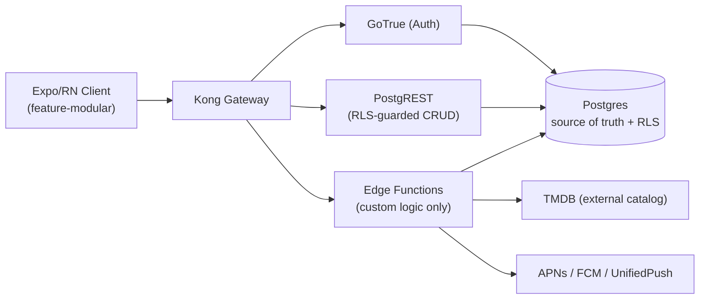
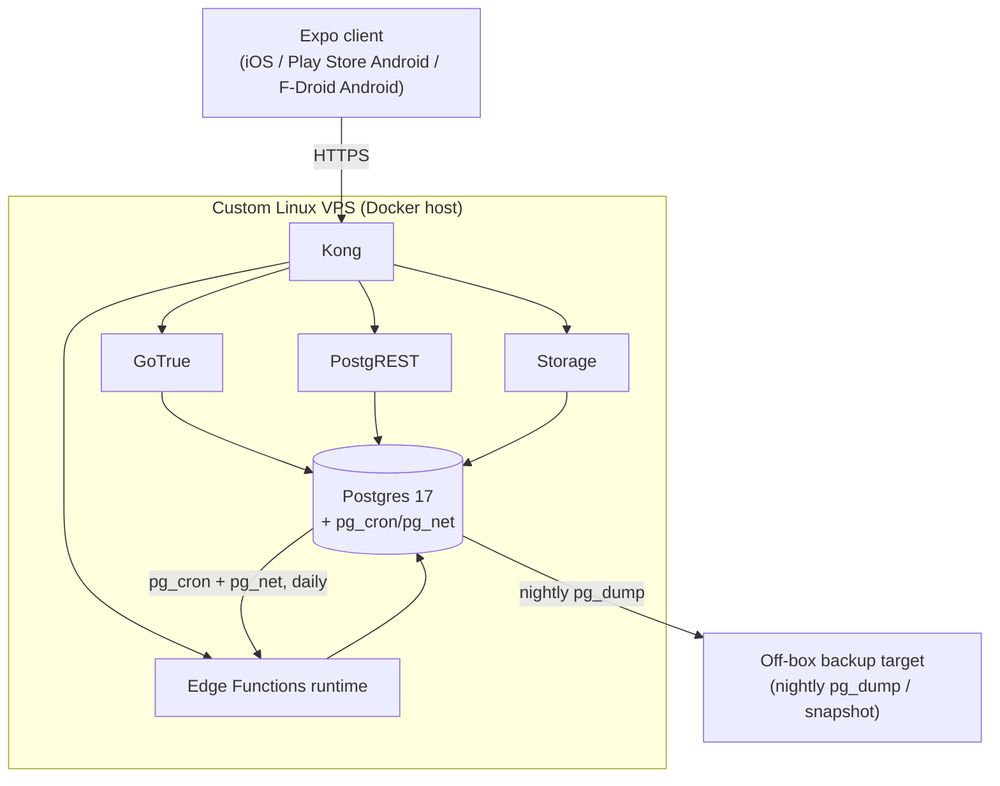
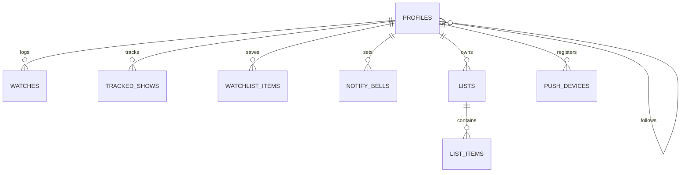

# Architecture Spine — tv-time-2

## Design Paradigm

**BaaS-core, RLS-as-authorization.** Postgres is the single source of truth *and* the authorization boundary — Row-Level Security policies implement the private-by-default visibility model (FR29/FR29a), never an app-code check. PostgREST auto-generates CRUD over RLS-protected tables; GoTrue owns identity; Edge Functions are the **only** home for logic that cannot be expressed as RLS-guarded CRUD (catalog proxy/cache, notification poller/fan-out, GDPR export/delete). The Expo/React Native client is feature-modular — one module per bottom-nav tab (Home, Diary, Add, Feed, Profile) — and never talks to Postgres or any third party directly: only through `supabase-js` CRUD calls or typed Edge Function calls.



## Invariants & Rules

### AD-1 — Authorization lives in Postgres RLS, not app code

- **Binds:** all tables with an actor FK to `auth.users` — including but not limited to `watches`, `watchlist_items`, `notify_bells`, `lists`, `list_items`, `profiles`, `tracked_shows`, `push_devices`, `follows`. No table is exempt by omission from this list.
- **Prevents:** a client or Edge Function shortcut that checks visibility in TypeScript and silently diverges from what PostgREST actually returns to a different caller; also prevents an implementer reading a short Binds list as exhaustive and skipping RLS on a table not named there.
- **Rule:** every such table carries `owner_id` (or, where there are multiple actor columns, e.g. `follows.follower_id`/`follows.followee_id`, RLS references whichever column(s) determine visibility for that table) + a nullable per-row `visibility` override on owner-scoped content tables. RLS `SELECT` policy: `owner_id = auth.uid() OR (EXISTS follow-edge AND effective_visibility = 'shared')`, where `effective_visibility` = row override if set, else the owner's `profiles.share_activity` global toggle (default off). `INSERT`/`UPDATE`/`DELETE` policies mirror the owner check (`owner_id = auth.uid()`) — no v1 flow lets a non-owner mutate another user's row. No table is exposed through PostgREST without an explicit RLS policy — deny by default. **Scope note (FR31):** this formula covers *personal-activity* visibility (watches/ratings/moods/notes) and blanket follower-visibility for lists; it does not model FR31's "shared lists" as selective per-recipient sharing — v1 lists are private-or-follower-visible only, same mechanism as everything else (see Deferred for selective recipients).

### AD-2 — Edge Functions are the only home for custom logic

- **Binds:** catalog access (FR6-9), notification fan-out (FR33-37), GDPR export/delete (FR4/FR5)
- **Prevents:** business logic leaking into the client (which would need the TMDB key or admin DB rights it must never hold) or into ad hoc SQL triggers that are hard to test and version.
- **Rule:** any behavior that isn't plain RLS-guarded CRUD is a named Edge Function in `supabase/functions/`. The client and pg_cron are the only two callers of Edge Functions; Edge Functions are the only code path with the TMDB key, push credentials, or cross-user DB access.

### AD-3 — Watch is the atomic timestamped unit `[ADOPTED]`

- **Binds:** `watches` (FR15, FR17-FR21)
- **Prevents:** modeling rating/mood as a single mutable field on a title, which would erase "how you felt then" — the product's core differentiator.
- **Rule:** rating, mood(s), and note are columns on `watches`, never on a `titles`/catalog entity. Each logged watch is its own row; re-tapping a rating (FR19) updates that row's columns, it never creates or collapses rows across separate watches of the same title.

### AD-4 — Watch commits, and the rating/mood/note that follows, are local-first via one durable outbox unit

- **Binds:** the log flow (FR14), the rating/mood/note prompt that immediately follows it (FR17-FR21), offline behavior (NFR8)
- **Prevents:** a watch commit that silently depends on network reachability, breaking the "faster than forgetting" promise and the FR14 network-disabled test — and, just as importantly, a rating/mood/note tap that fires an immediate `PATCH` against a server row that doesn't exist yet because the commit itself hasn't synced (the default case per UJ-1: log, then rate, in one uninterrupted beat).
- **Rule:** the client writes a watch commit to a local `expo-sqlite` table (`pending_watches`) synchronously before any network call; that same row carries nullable rating/mood/note columns. A rating/mood/note edit always writes to the local row first — it is never a bare `PATCH` assumed to hit an already-synced server row. A sync worker drains the outbox to `watches` via PostgREST: if the row is still pending, it's a single insert carrying commit + rating/mood/note together; if the commit already synced (fast connectivity), the edit becomes a normal `PATCH` keyed by the now-known server id. Either way, the client never sends a mutation for the rating half without first confirming which state the row is in. This is the only durable local write path — it is not a general offline-first sync framework (NFR8 caps v1 offline at "basic, not optimized"); all other reads use `TanStack Query`'s persisted cache, which is disposable, not authoritative.

### AD-5 — Notification fan-out runs on a bounded daily cadence, never per-event real-time

- **Binds:** `poll-new-episodes` Edge Function, `notify_bells`, `push_devices`, `known_episode_state` (FR33-37, addendum H3)
- **Prevents:** an always-on per-user watcher process, which is the single most expensive thing a no-budget solo instance could build, and which the addendum explicitly steers away from; also prevents the poller's diff baseline being silently evicted by the unrelated search-cache TTL policy.
- **Rule:** `pg_cron` invokes `poll-new-episodes` once daily via `pg_net` over Docker-internal networking (never `localhost`/`127.0.0.1` — the DB container cannot reach itself that way; both extensions ship in the self-hosted Postgres image but require an explicit `CREATE EXTENSION pg_cron` / `CREATE EXTENSION pg_net` plus `shared_preload_libraries` migration step — "bundled" is not "enabled"). The function walks distinct `tmdb_id` values (`media_type = 'tv'`) with an active bell, diffs against **`known_episode_state`** (`tmdb_id`, `tmdb_episode_id`, `last_known_air_date`, `checked_at`) — a table dedicated to this diff, owned by this AD, separate from `catalog_cache`'s disposable TTL cache (AD-6) so search-driven cache eviction can never desync a notification baseline — and fans out per `push_devices` row using the channel recorded there (APNs / FCM / UnifiedPush). No other path sends a push.

### AD-6 — Catalog access is always proxied and cached, never direct from the client

- **Binds:** `catalog-search`, `catalog-title` Edge Functions, `catalog_cache` table (FR6-9, NFR9, addendum H2)
- **Prevents:** shipping the TMDB key in the open-source F-Droid client binary, and hammering TMDB on every keystroke.
- **Rule:** the client calls only `catalog-search`/`catalog-title`; these functions hold the TMDB key server-side, read/write `catalog_cache` (`tmdb_id`, `media_type`, `payload jsonb`, `fetched_at`) with a TTL, and are the sole callers of the external catalog. `catalog_cache` is disposable and freely evictable — it exists only to make repeat lookups fast, never as a system-of-record. It is a **different table** from AD-5's `known_episode_state`, which the notification poller owns for its own durability needs; nothing else may read or evict `known_episode_state`.

### AD-7 — TV Time import idempotency — RETIRED (2026-07-02)

- **Status:** Cut with the TV Time import feature (FR38–41 out of v1 — see PRD). No `import-tvtime` function, no `source_watch_id` column, and no import unique-constraint exist in v1. The number is kept to preserve AD-8…AD-13 references.
- **If revived post-v1:** idempotent upsert keyed on a stable `(user, title, episode, source-id)` tuple, never fabricating timestamps (missing source date → `watched_at = null` + `approximate = true`). Reintroduce as a fresh AD then.

### AD-8 — GDPR export/delete are dedicated, structurally-cascading Edge Functions

- **Binds:** `export-my-data`, `delete-my-account` (FR4, FR5, NFR6)
- **Prevents:** an incomplete export or delete because some new table was added later and a hand-maintained loop forgot to include it — including the multi-actor case, not just the simple single-owner case.
- **Rule:** every FK referencing `auth.users.id`, on any table — not only a table's primary `owner_id` — is `ON DELETE CASCADE`. This explicitly includes self-referential/multi-actor tables: `follows.follower_id` **and** `follows.followee_id` both cascade, so deleting a user unwinds both the accounts they follow and the accounts that follow them. `delete-my-account` deletes the `auth.users` row and relies on cascade everywhere, not per-table application code. `export-my-data` enumerates owner-scoped tables by FK introspection, not a hardcoded list.

### AD-9 — Nightly off-box backup is mandatory before go-live

- **Binds:** the VPS Postgres volume (NFR11)
- **Prevents:** the wind-down pledge ("your history is yours and portable") being hollow if the one VPS is lost before a user ever exports — backups, not uptime, are what makes the promise real.
- **Rule:** a nightly `pg_dump` (or volume snapshot) ships off the VPS to separate storage before the app is considered launch-ready. This is a release gate, enforced as a launch-checklist item: go-live is blocked until a dated backup file is confirmed present in off-box storage, not just "the cron job exists."

### AD-10 — The next-episode pointer is derived, single-writer, never client-computed

- **Binds:** `tracked_shows.next_episode_pointer`, organic watch commits (FR11), the rewatch/edit recompute path (FR16)
- **Prevents:** two independently-correct-looking writers (a client that computes-and-PATCHes the pointer directly, and the rewatch/edit recompute path that also touches it) silently disagreeing — in particular, a watch mutation populating `watches` but leaving a stale pointer with no error surface.
- **Rule:** `next_episode_pointer` advancement happens through exactly one path: a Postgres function (`recompute_next_episode_pointer(user_id, tmdb_id, media_type)`, derive-from-full-watch-set, not a monotonic increment) exposed as a PostgREST RPC. `media_type` is part of the signature because `tmdb_id` is only unique within a media type — a movie and a tv show can share one, and `tracked_shows`' identity key is `(user_id, tmdb_id, media_type)`. The client calls this RPC — it never issues a raw `PATCH` against `tracked_shows.next_episode_pointer`. The same function serves both organic advance (log) and recompute-after-delete (edit/remove, FR16), and is idempotent under retry. There is no second computation of "what's next."

### AD-11 — GDPR hosting jurisdiction is EU/EEA, not left implicit

- **Binds:** the production VPS (NFR6)
- **Prevents:** the PRD's own "to be met, not hand-waved" GDPR obligation quietly becoming an unresolved question no one owns.
- **Rule:** the production VPS is hosted in an EU/EEA jurisdiction. This is a go-live gate alongside AD-9's backup requirement — launch is blocked until the hosting provider/region is confirmed EU/EEA.

### AD-12 — F-Droid auth stays Google/Firebase-free by construction

- **Binds:** GoTrue configuration (FR1, FR3, NFR3)
- **Prevents:** a future engineer adding a native "Sign in with Google" button for the Play Store/iOS builds that either has to be awkwardly excluded from the F-Droid variant after the fact, or ships everywhere and silently breaks F-Droid eligibility.
- **Rule:** GoTrue's enabled auth methods are limited to flows with no Google/Firebase dependency — email/password and magic link for v1. Any OAuth provider addition must be audited against NFR3 (and explicitly scoped out of the F-Droid build variant if added) before being enabled — it is never a default-on decision.

### AD-13 — The self-hosted Supabase stack is pinned to a dated release, never tracked as "latest"

- **Binds:** `supabase/docker-compose.yml` (the whole self-hosted stack: Postgres, GoTrue, PostgREST, Storage, Edge Functions runtime, Kong)
- **Prevents:** local dev and the production VPS independently pulling "latest" at different times and silently diverging (the self-hosted compose file has changed meaningfully release-to-release — e.g. its default Postgres image moved 15→17 within weeks of this spine being written).
- **Rule:** `docker-compose.yml` pins a specific dated release tag, recorded in-repo. Upgrading is a deliberate, tested step (a PR that bumps the pinned tag) — never an ad hoc `docker compose pull` against a floating `latest`.

## Consistency Conventions

| Concern | Convention |
| --- | --- |
| Naming (entities, files, interfaces, events) | Postgres tables/columns: `snake_case` (PostgREST default). TS client/Edge Function code: `camelCase`. **Catalog identifiers (binding — no table invents an alternate name):** every table referencing a catalog title/show/movie uses the column name `tmdb_id`, with a `media_type` (`'movie' \| 'tv'`) discriminator where ambiguous; a table needing episode-level granularity (only `watches`) additionally carries a nullable `tmdb_episode_id` (null for films). Never `tmdb_show_id`, `mapped_title_or_episode_id`, or any other synonym. Edge Function names are verb-first (`catalog-search`, `poll-new-episodes`, `export-my-data`). |
| Data & formats (ids, dates, error shapes, envelopes) | Ids: `uuid` (`gen_random_uuid()`) on every owned entity. Timestamps: `timestamptz`, UTC, ISO 8601 at the API boundary. Rating: `smallint` half-steps (0–10 = 0–5★). Moods: `text[]` constrained by a Postgres **check constraint** (not an `ENUM` type). The v1 mood set is **LOCKED** (OQ#5 resolved) to FR18's 8 chips; `text[]`+`CHECK` is still preferred over `ENUM` so the set stays trivially migratable in both directions if it ever changes — never validated only in client code. Errors: PostgREST/GoTrue's default `{message, code, details}` JSON envelope; Edge Functions must emit the same shape. |
| State & cross-cutting (mutation, errors, logging, config, auth) | All mutation goes through PostgREST (RLS-guarded) or an Edge Function — the client never gets a service-role key. Auth: GoTrue JWT bearer on every request; Edge Functions verify it via the Supabase auth helper, never trust an unsigned user id. Config: `.env` on the VPS, never committed; `.env.example` tracked in `supabase/`. Logging: Docker-captured stdout/stderr from each service; no separate log aggregator in v1. |

## Stack

<!-- verified 2026-07-02 against Expo/Supabase changelogs, npm, and GitHub release notes; cross-checked rows against each other after an initial pass caught a TS/Expo-SDK mismatch -->

| Name | Version |
| --- | --- |
| Expo SDK | 56 (React Native 0.85, React 19.2) |
| TypeScript | 6.0.3 (matches Expo SDK 56's own baseline) — note: `types` now defaults to an empty array (no implicit `@types` pickup); Edge Function `tsconfig` must list needed `@types` explicitly |
| Self-hosted Supabase (docker-compose) | pinned dated release tag (AD-13) — never tracked as `latest` |
| Postgres (bundled in Supabase image) | 17 (Supabase's current default as of June 2026; vanilla Postgres is a generation ahead at 18 GA / 19 beta, not relevant here since this row is scoped to the Supabase-bundled image) |
| PostgREST, GoTrue, Storage, Edge Functions (Deno runtime), Kong | bundled versions from the Supabase docker-compose release in use |
| pg_cron, pg_net (Postgres extensions) | bundled in the self-hosted Supabase Postgres image |
| @tanstack/react-query | latest 5.x |
| expo-sqlite | latest matching Expo SDK 56 |
| expo-notifications | latest matching Expo SDK 56 (iOS APNs, Play Store Android FCM) |
| expo-unified-push | latest (F-Droid/Android UnifiedPush path only — Android-only library) |
| Docker Engine / Docker Compose | 20.10+ / v2+ on the VPS |

## Structural Seed

```text
tv-time-2/
  app/                     # Expo/React Native client
    features/
      home/                # Up Next, Watchlist shelf, Recommendations shelf
      diary/
      add/                 # search + fast-add flow, center (+) tab
      feed/
      profile/             # stats, settings, theme
    data/                  # supabase-js client, typed query hooks, outbox/sync worker
    components/            # shared UI primitives
  supabase/
    docker-compose.yml
    .env.example
    migrations/            # SQL schema + RLS policies
    functions/
      catalog-search/
      catalog-title/
      poll-new-episodes/
      export-my-data/
      delete-my-account/
  packages/
    shared-types/          # generated Supabase types + zod schemas (mood enum, note cap) shared client<->functions
```

### Deployment & Environments



Two environments only for v1: local dev (`docker compose` + Expo dev client) and the single production VPS. No staging environment (see Deferred) — solo maintainer, low stakes, matches the "relaxed build timeline" framing in the PRD. The production VPS is hosted in an **EU/EEA jurisdiction** (AD-11) — a go-live gate, same treatment as AD-9's backup requirement.

### Core Entity Relationships



Two supporting tables are intentionally not FK'd into this graph — neither is user-owned:
- `catalog_cache` — a disposable TTL cache keyed loosely by `tmdb_id`; every table above that references a catalog title/episode does so by `tmdb_id` value, not a foreign key into a local `titles` table (there isn't one).
- `known_episode_state` (AD-5) — the notification poller's own durable diff baseline (`tmdb_id`, `tmdb_episode_id`, `last_known_air_date`, `checked_at`), deliberately separate from `catalog_cache` so the two tables' different durability contracts (disposable vs. must-persist-across-cron-runs) can never collide.

## Capability → Architecture Map

| Capability / Area | Lives in | Governed by |
| --- | --- | --- |
| Accounts & Identity (FR1-5) | GoTrue, `profiles`, `export-my-data`/`delete-my-account` | AD-8, AD-12 |
| Catalog & Search (FR6-9) | `catalog-search`/`catalog-title` Edge Functions, `catalog_cache` | AD-6 |
| Tracking & Logging (FR10-16) | `watches`, `tracked_shows`, `recompute_next_episode_pointer` RPC, client outbox | AD-3, AD-4, AD-10 |
| Rating & Reaction (FR17-21) | `watches` columns | AD-3, AD-4 |
| Diary & Profile (FR22-24) | `watches`/`profiles` read via PostgREST + RLS | AD-1 |
| Watchlist (FR25-26) | `watchlist_items` | AD-1 |
| Community / Social (FR27-32) | `follows`, `lists`, `list_items`, RLS visibility | AD-1, AD-8 |
| Notifications (FR33-37) | `notify_bells`, `push_devices`, `known_episode_state`, `poll-new-episodes` + pg_cron | AD-5 |
| ~~TV Time Import (FR38-41)~~ | **Cut from v1** (see PRD) — no `import-tvtime`, no import constraint | ~~AD-7~~ (retired) |
| Recommendations (FR42) | optional heuristic, not on the critical path | Deferred |
| Navigation & Interaction (FR43-45) | client feature-module structure | Design Paradigm |
| GDPR / hosting compliance (NFR6) | production VPS region | AD-11 |

## Deferred

- **F-Droid UnifiedPush wiring** — `expo-unified-push` config-plugin integration, the "no distributor installed" degraded UX (FR37), and the F-Droid build-variant CI setup are a hands-on spike at build time, not an architecture-level call.
- **OQ#11 — TMDB licensing + fallback catalog** — needs the creator to actually verify TMDB's terms/F-Droid compatibility and name a fallback (Trakt/TVDB/Wikidata) with a switch trigger. Architecture only requires that catalog access stays behind the `catalog-search`/`catalog-title` boundary (AD-6), so swapping the provider later doesn't touch the client.
- ~~**Mood chip canonical set (OQ#5)**~~ — **RESOLVED (2026-07-02):** locked to FR18's 8 chips; `DESIGN.md` reconciled. Schema unchanged (`text[]` + `CHECK`); no longer deferred.
- **Staging environment** — not worth the ops overhead for a solo maintainer at v1 scale; revisit if community contributors start landing riskier changes.
- **Per-entry visibility override UI** — the schema supports it now (AD-1's nullable per-row override), but whether v1 ships UI for it beyond the global toggle is a UX/epics scope call, not an architecture one.
- **Selective (per-recipient) list sharing (FR31)** — AD-1's visibility formula covers private-or-follower-visible only; a `list_shares(list_id, shared_with_user_id)` join table for sharing with specific people rather than all followers is a real but separable extension, deferred until product confirms v1 needs it.
- **TMDB rate-limit/backpressure handling under load (NFR9)** — AD-6's TTL cache handles repeat-query cost, but not what happens if TMDB itself throttles a burst of cache-miss traffic. Out of scope for v1's expected scale (solo instance, "a handful of friends"); revisit if usage grows.
- **Recommendations heuristic (FR42)** — deliberately unspecified; may ship absent, as a curated shelf, or a simple heuristic Edge Function. Not load-bearing for any user journey (see PRD UJ-1).
